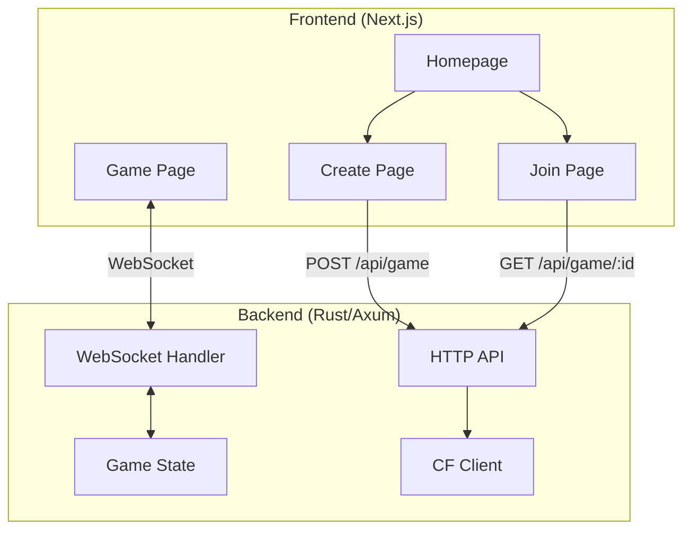

# Battle CP - Codebase Documentation

## Quick Start

```bash
# Terminal 1: Backend (Rust)
cd backend
cargo run  # Runs on http://localhost:3000

# Terminal 2: Frontend (Next.js)
cd frontend
npm run dev  # Runs on http://localhost:3001
```

---

## Architecture Overview



---

## Backend Structure (`backend/src/`)

| File | Purpose |
|------|---------|
| `main.rs` | Entry point, sets up Axum server on port 3000 |
| `handlers.rs` | HTTP endpoints: `POST /api/game`, `GET /api/game/:id` |
| `ws.rs` | WebSocket handler - all real-time game communication |
| `state.rs` | `AppState`, `GameState`, `GameStatus` enum |
| `game.rs` | Core game logic: ships, grid, firing, placement, vetoes |
| `protocol.rs` | `ClientMessage` and `ServerMessage` enums (JSON protocol) |
| `cf_client.rs` | Codeforces API integration (handle validation) |
| `background.rs` | Background tick task (sends periodic `GameUpdate`) |

### WebSocket Protocol

**Client → Server:**
```rust
enum ClientMessage {
    JoinGame { game_id, player_id, cf_handle },
    PlaceShips { ships: Vec<Ship> },
    ConfirmPlacement,
    Fire { x, y },
    Veto,
}
```

**Server → Client:**
```rust
enum ServerMessage {
    GameJoined { game_id, player_id },
    PlayerJoined { player_id },
    ShipsConfirmed { player_id },
    GameUpdate { status, your_turn, heat, ... },
    GameStart,
    FireResult { ... },
    Error { message },
}
```

### Game Status Flow

```
Waiting → PlacingShips → Combat → Finished
```

---

## Frontend Structure (`frontend/app/`)

| Route | File | Purpose |
|-------|------|---------|
| `/` | `page.tsx` | Landing page with START/JOIN buttons |
| `/lobby/create` | `lobby/create/page.tsx` | Create game, get game ID |
| `/lobby/join` | `lobby/join/page.tsx` | Enter game ID to join |
| `/game/[id]` | `game/[id]/page.tsx` | Main game interface |

### Key Components

| Path | Purpose |
|------|---------|
| `components/ui/FaultyTerminal.tsx` | Animated terminal background (OGL WebGL) |
| `hooks/useGameSocket.ts` | WebSocket connection management |
| `components/game/` | Game-specific components |

### State Management

- `localStorage` stores `battlecp_player_id` and `battlecp_cf_handle`
- WebSocket messages update React state via `useGameSocket` hook
- Game phases determined by `status` field in `GameUpdate`

---

## Testing Instructions

### Manual 2-Player Test

1. **Open 2 browser windows** (or use incognito for 2nd player)

2. **Player 1 (Host):**
   - Go to `http://localhost:3001`
   - Click START → Enter CF handle → GENERATE LOBBY
   - Copy the game ID
   - Click ENTER

3. **Player 2 (Guest):**
   - Go to `http://localhost:3001/lobby/join`
   - Enter CF handle and paste game ID
   - Click CONNECT

4. **Both players should see "DEPLOY YOUR FLEET"**

5. **Place ships** by clicking grid cells
6. **Click CONFIRM DEPLOYMENT** when done
7. **Combat phase** begins when both confirm

### Test Checklist

- [ ] Homepage background reacts to mouse
- [ ] Create/Join pages have green/purple backgrounds
- [ ] Both players transition to PlacingShips
- [ ] Ship placement works on grid
- [ ] Confirm Deployment button works
- [ ] Combat phase begins after both confirm

---

## Known Issues & Fixes

### "AWAITING OPPONENT" Bug (FIXED)
**Problem:** Host didn't know Guest joined.
**Fix:** Fallback `PlayerJoined` in tick handler (`ws.rs:125-132`).

### Homepage Background Not Interactive (FIXED)
**Problem:** Main content blocked mouse events.
**Fix:** Added `pointer-events-none` to main, `pointer-events-auto` to buttons.

---

## Common Debugging

### Backend Logs
```bash
# Watch for these logs:
[WS] Player X connected to game Y
[WS] Broadcast PlayerJoined - result: Ok, subscribers: N
```

### Frontend Console
```javascript
// Check for:
"[useGameSocket] Message received:", {type: ...}
"[useGameSocket] → PlayerJoined for:", playerIdXXX
```

### Check WebSocket Connection
In browser DevTools → Network → WS tab → Look for `/ws` connection.

---

## Environment Variables

| Variable | Default | Purpose |
|----------|---------|---------|
| `NEXT_PUBLIC_API_URL` | `http://localhost:3000` | Backend URL |

---

## File Quick Reference

```
BattleCP/
├── backend/
│   ├── Cargo.toml
│   └── src/
│       ├── main.rs         # Entry, router setup
│       ├── handlers.rs     # HTTP API
│       ├── ws.rs           # WebSocket (main logic)
│       ├── game.rs         # Game rules
│       ├── state.rs        # Shared state
│       ├── protocol.rs     # Message types
│       ├── cf_client.rs    # Codeforces API
│       └── background.rs   # Tick timer
│
├── frontend/
│   ├── package.json
│   ├── app/
│   │   ├── page.tsx           # Homepage
│   │   ├── lobby/create/      # Create game
│   │   ├── lobby/join/        # Join game
│   │   └── game/[id]/         # Game play
│   ├── components/
│   │   ├── ui/                # Shadcn + custom
│   │   └── game/              # Game-specific
│   └── hooks/
│       └── useGameSocket.ts   # WS hook
```
